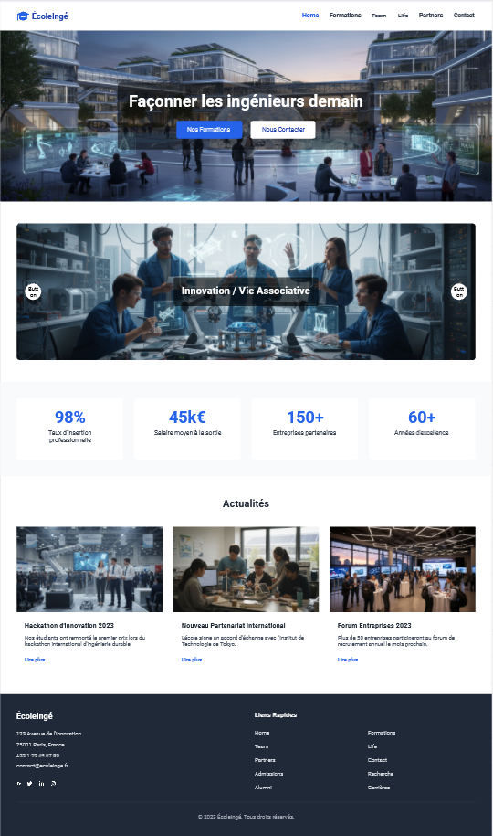

# 🎓 EFREI - Grande École du Numérique (Portfolio Project)



## 📝 À propos du projet

Ce projet est une intégration web (HTML/CSS/JS) réalisée dans le cadre d'un projet étudiant visant à créer une vitrine numérique pour l'EFREI. Il a été entièrement refactorisé pour adopter des standards professionnels et servir d'exemple solide de développement Front-end natif dans un portfolio.

L'objectif principal était de concevoir une interface moderne, performante, accessible et responsive "pixel-perfect", tout en n'utilisant aucune librairie externe (Vanilla Javascript, Pure CSS).

## ✨ Fonctionnalités clés

*   **Design Moderne & Premium** : Utilisation du Glassmorphism, d'ombres douces, d'animations au survol (micro-interactions) et d'une typographie soignée (Google Fonts : *Outfit* et *Inter*).
*   **100% Responsive Design** : L'interface s'adapte parfaitement à toutes les tailles d'écrans (Mobiles, Tablettes, Desktop) avec un menu de navigation Off-canvas optimisé pour le tactile.
*   **Carrousel Interactif Custom** : Un carrousel d'images fluide développé en pur JavaScript, avec prise en charge complète du défilement tactile (Swipe) sur mobile.
*   **Validation de Formulaire Dynamique** : Le formulaire de contact intègre des feedbacks utilisateur en temps réel injectés dans le DOM (remplacement complet des popups `alert()` obsolètes).
*   **Optimisation SEO & Accessibilité (A11y)** : Code sémantique, balises Méta/Open Graph intégrées, attributs `aria-label` ajoutés pour la navigation au clavier et les lecteurs d'écran.
*   **Easter Egg Multilingue** : Intégration d'un système multilingue via dropdown, avec un comportement caché amusant (Easter Egg : 3 clics sur le logo déclenchent une redirection vers la version "Franglais").

## 🛠️ Technologies Utilisées

*   **HTML5** : Structure sémantique respectant les normes W3C.
*   **CSS3** : Flexbox, CSS Grid, Variables natives (Custom Properties), Animations (Keyframes, Transitions), et propriétés modernes (backdrop-filter).
*   **JavaScript (ES6+)** : Manipulation du DOM, gestion des événements de façon optimisée, timeout/interval, et support du Touch Event API.

## 🚀 Installation & Exécution

Ce projet est purement statique et ne nécessite aucune dépendance serveur complexe ou étape de build (Node.js n'est pas requis).

1. Clonez ce dépôt :
   ```bash
   git clone https://github.com/votre-compte/projet_prog_web.git
   ```
2. Accédez au répertoire :
   ```bash
   cd projet_prog_web
   ```
3. Ouvrez le fichier `index.html` directement dans votre navigateur web, ou utilisez une extension comme **Live Server** sur VSCode pour un meilleur confort de développement.

## 📁 Architecture du Projet

```text
├── assets/
│   ├── css/
│   │   ├── style.css         # Styles principaux et variables
│   │   └── frenglish.css     # Styles additionnels pour l'easter egg
│   ├── img/                  # Images compressées et optimisées
│   └── js/
│       └── script.js         # Logique Front-end (Vanilla JS)
├── docs/                     # Maquettes originales et documents du projet
├── index.html                # Page d'accueil (FR)
├── index_en.html             # Page d'accueil (EN)
├── formations.html           # Page Formations
├── contact.html              # Page de contact
└── ...                       # Autres pages du site
```

## 👨‍💻 Développeur

Développé dans un contexte académique, puis modernisé et optimisé pour atteindre une qualité professionnelle de production.
